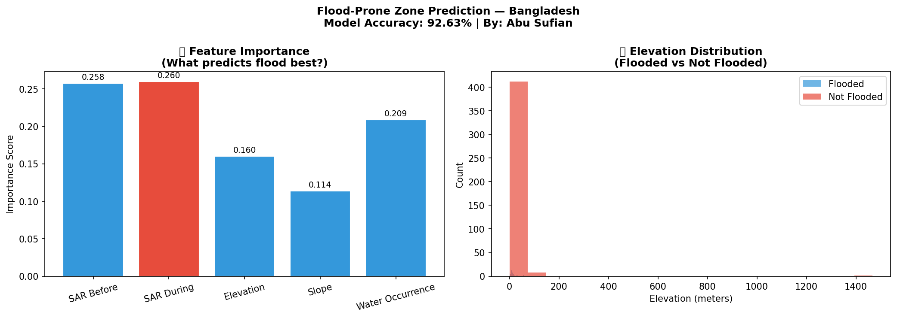

# 🌊 Flood-Prone Zone Prediction — Bangladesh


## 📌 Overview

This project predicts flood-prone zones in Bangladesh using
Sentinel-1 SAR satellite imagery and a Random Forest ML model,
trained on flood events from 2017, 2019, and 2020.

**Key Result: 92.63% prediction accuracy**

---

## 🔬 Key Research Findings

| Feature | Importance Score |
|---|---|
| SAR During Flood | 0.260 (most important) |
| SAR Before Flood | 0.258 |
| Water Occurrence | 0.209 |
| Elevation | 0.160 |
| Slope | 0.114 |

> SAR backscatter signal during flood events is the strongest
> predictor of flood-prone zones, followed by historical
> water occurrence near rivers.

### Model Performance
| Metric | Score |
|---|---|
| Overall Accuracy | 92.63% |
| Precision (Non-flood) | 0.94 |
| Recall (Non-flood) | 0.98 |
| F1-Score (weighted) | 0.92 |

---

## 🗺️ Visualizations



---

## 🔬 Methodology

### Data Sources
- **Sentinel-1 SAR** — VV polarization, flood signal detection
- **SRTM DEM** — Elevation and slope calculation
- **JRC Global Surface Water** — Historical water occurrence

### Flood Events Used for Training
| Year | Period |
|---|---|
| 2017 | June (before) vs August (during) |
| 2019 | June (before) vs July-August (during) |
| 2020 | May (before) vs July (during) |

### ML Pipeline
1. SAR image differencing (before vs during flood)
2. Feature stacking (SAR + DEM + slope + water occurrence)
3. Stratified sampling (471 points across Bangladesh)
4. Random Forest Classifier (100 estimators)
5. 80/20 train-test split

### Why SAR?
SAR (Synthetic Aperture Radar) can penetrate clouds and
works at night — critical for Bangladesh where floods happen
during monsoon season with heavy cloud cover.

---

## 🛠️ Tools & Technologies

| Tool | Purpose |
|---|---|
| Google Earth Engine | Satellite data processing |
| Python 3.12 | ML pipeline & visualization |
| Sentinel-1 SAR | Flood detection |
| SRTM DEM | Elevation data |
| scikit-learn | Random Forest model |
| geemap + matplotlib | Visualization |

---

## 📂 Project Structure
```
flood-prone-prediction-bd/
│
├── 03-flood-prone-prediction-bangladesh.ipynb
├── flood_prediction_results.png
├── README.md
└── .gitignore
```

## 🚀 How to Run

1. Open Google Colab
2. Run `03-flood-prone-prediction-bangladesh.ipynb`
3. Authenticate Google Earth Engine when prompted
4. Run all cells in order

---

## 👨‍🔬 Researcher

**Abu Sufian**
Class 11 | Tongi Govt. College, Gazipur, Bangladesh
Focus: AI Engineering & Environmental Research
GitHub: [@abusufian-dev](https://github.com/abusufian-dev)

---

## 🎯 Research Goal

This project is part of a 4-project AI research portfolio
aimed at securing a fully-funded scholarship in AI Engineering
at a globally recognized research university.


| 4 | AI Tool Building | 🔜 Next |
| 5 | Kaggle Competition | 🔜 Upcoming |
